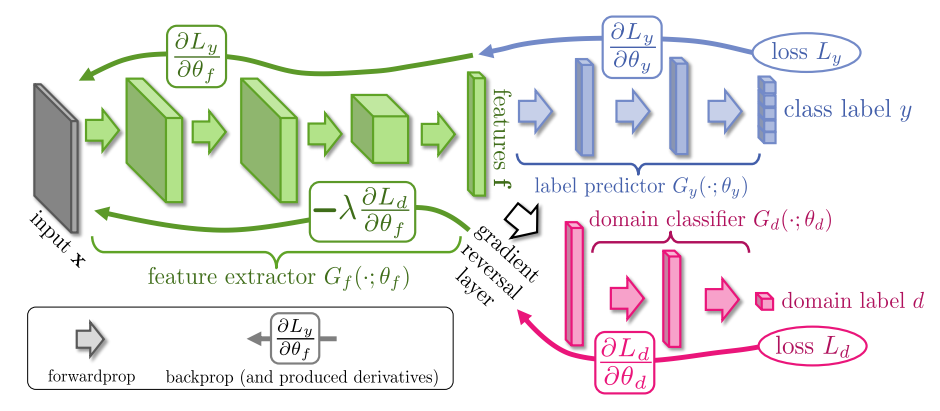
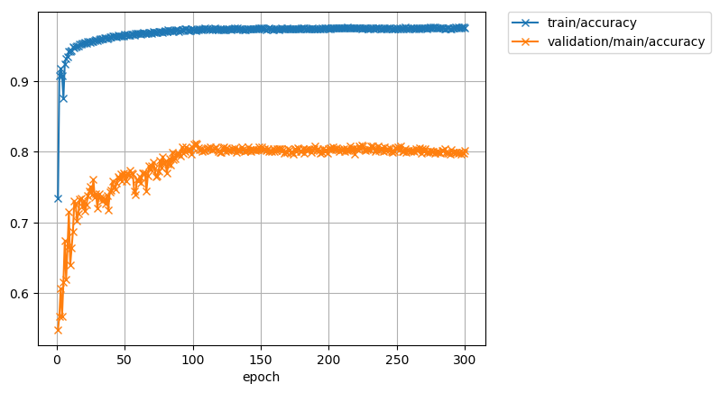
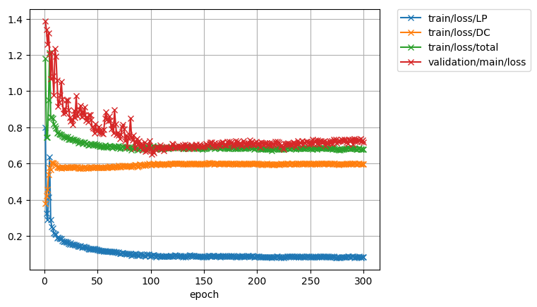

# chainer-DANN
Implementation of [Unsupervised Domain Adaptation by Backpropagation (Y.Ganin & V.Lempitsky ICML'15)](http://sites.skoltech.ru/compvision/projects/grl/)



## Environment

Ubuntu 14.04 LTS
<br>
Python 3.5.2 with Anaconda3 4.2.0
#### External Libraries
|Library  |Version| 
|:-------:|:-----:|
|chainer  |2.0.0  |
|cupy     |1.0.0  |
|numpy    |1.14   |


## Dataset
Source: MNIST
<br>
Target: MNIST-M

Dataset link : [Mnist2MnistM](https://www.dropbox.com/s/grg991r6bxy51p5/Mnist2MnistM.zip?dl=0)

MNIST-M original link(Projects Link) : [http://yaroslav.ganin.net/](http://yaroslav.ganin.net/)

## Implementation Result
Validation data : target data (without Train Data).

|Train Data(Source/Target)|Accuracy(Paper|Accuracy(Impl| 
|:-----------------------:|:------------:|:-----------:| 
|Mnist/Mnist-M            |81.49\%       |80.81\%      |

#### Accuracy


#### Loss
```train/loss/LP```: Label Predictor Loss
<br>
```train/loss/DC```: Domain Classifier Loss



## Usage
Open ```train.py``` and change ```data_root``` path.
<br>
Run ```python train.py```.

Class label is acquired from the directory where the image file is located and the directory name must be class ID. <br>
Therefore, image files must be arranged and be renamed directory for each class.

